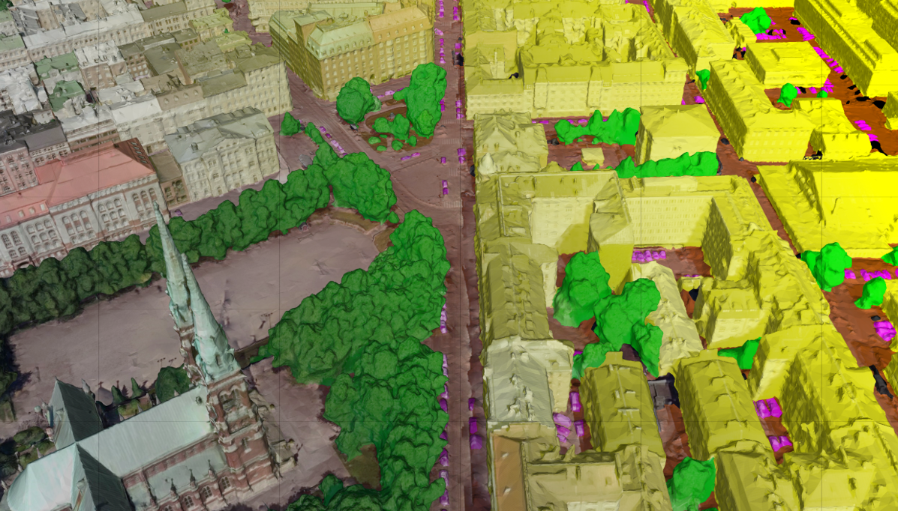

# SUMS: **S**emantic **U**rban **M**esh **S**egmentation.

**SUMS** is the official implementation of the paper: [*SUM: A Benchmark Dataset of Semantic Urban Meshes*](https://www.sciencedirect.com/science/article/pii/S0924271621001854). 
Specifically, it is an open-source program for automatic semantic segmentation of large-scale urban texture meshes.
It is mainly implemented in C++ and other open-source libraries, such as [CGAL](https://www.cgal.org/) and [Easy3D](https://github.com/LiangliangNan/Easy3D).
For more information, please visit our [project website](https://3d.bk.tudelft.nl/projects/meshannotation/).

<div align="center">    

</div>

## Citation

If you use it in a scientific work, we kindly ask you to cite it:

<div class="filteredelement"><strong> SUM: A Benchmark Dataset of Semantic Urban Meshes </strong>. Weixiao Gao, Liangliang Nan, Bas Boom and Hugo Ledoux. <em> ISPRS Journal of Photogrammetry and Remote Sensing</em> 179 (2021) 108-120. <br/><a href="https://www.sciencedirect.com/science/article/pii/S0924271621001854"><i class="fas fa-external-link-alt"></i> PDF</a> <a href="#myref" data-toggle="collapse"><i class="fas fa-caret-square-down"></i> BibTeX</a> <div id="myref" class="collapse" tabindex="-1"><pre class="bibtex">@article{sum2021,
author = {Weixiao Gao and Liangliang Nan and Bas Boom and Hugo Ledoux},
title = {SUM: A Benchmark Dataset of Semantic Urban Meshes},
journal = {ISPRS Journal of Photogrammetry and Remote Sensing},
volume = {179},
pages = {108-120},
year={2021},
issn = {0924-2716},
doi = {10.1016/j.isprsjprs.2021.07.008},
url = {https://www.sciencedirect.com/science/article/pii/S0924271621001854},
}
</pre></div></div>

## Usage
The program is currently only supported to run and compile on **Windows 10** system.
To use this program on other operating systems, the source code will need to be modified and updated.
If you would like to contribute to this project, please contact the author.

### Data organization
For the organization of the data in the folders, please refer to the [demo data](https://3d.bk.tudelft.nl/opendata/sum/1.0/data_demo/).

For the structure of `*.ply` data, we have added the following additional items.

|    names                 |    ply types      |    data types     |    description                                                      |
| :----------------------: |  :--------------: | :---------------: | :-----------------------------------------------------------------: |
| label                    | comment           | -                 | label definition, e.g., `comment label 1 ground`                  |
| label                    | property (face)   | int               | label stored at each facet                                          | 
| face_segment_id          | property (face)   | int               | segment id stored at each facet                                     |
| label_probabilities      | property (face)   | float             | probabilities stored at each facet                                  |
| segment_xxx_features_xxx | property (face)   | float             | features stored at each facet for visualization as scalar field     |
| segment_xxx_features_xxx | property (vertex) | list uint32 float | features stored at each vertex as intermediate data for computation |

### Data requirements
For the **format** of input meshes, the current program only support [`*.ply`](http://paulbourke.net/dataformats/ply/) 
format triangular meshes and `*.jpg` format textures, and each mesh file must have associated textures. 
For the mesh **topologies**, we only support manifold meshes.
For the **size** of mesh tiles, each tile should be larger than 50 x 50 m.  

### Running the code
Before you run the program, make sure that your input data meet the requirements and that you have configured `config.txt`.
You can refer to the [demo data](https://3d.bk.tudelft.nl/opendata/sum/1.0/data_demo/) to check how to prepare the configuration file.
Besides, you need to install [`Python (>=3.7)`](https://www.python.org/), [`imbalanced-learn`](https://imbalanced-learn.org/), and [`numpy`](https://numpy.org/), and replace the `..\Python\Python37\Lib\site-packages\imblearn\over_sampling\_smote\filter.py` with provided `..\3rd_party\python_parsing\py_aug\filter.py`.
You could run the code as follows: 
```
.\semantic_urban_mesh_segmentation.exe [path to config.txt]
```

### Operation modes
* **Pipeline**: Run the following modes in sequence: Mesh_feature_extraction, Train_and_Test_config, and Data_evaluation_for_all_tiles_config.
* **Mesh_feature_extraction**: Perform mesh-oversegmentation and extract segment-based features.
* **Train_config**: Use random forest to train the extracted features.
* **Test_config**: Use the trained model(`trained_model.gz`) and extracted features to classify the test data. Please note that the trained model is not used for direct decompression. The user can read it directly from the `data/model/trained_model.gz` folder by setting the operation mode to 'Test_config'. 
* **Train_and_Test_config**: Run Train_config and Test_config in sequence.
* **Data_evaluation_for_all_tiles_config**: Evaluate all test results (based on mesh area, not on the number of triangles).
* **Save_mesh_features_for_visualization**: Save mesh features in a [`*.ply`](http://paulbourke.net/dataformats/ply/) file, the user can visualise these features in scalar rendering mode using [Mapple](https://3d.bk.tudelft.nl/liangliang/software/Mapple.zip).
* **Class_statistics**: Output class statistics on mesh area and segments.
* **Generate_semantic_sampled_points**: Sampling the mesh into a point cloud, and the output point cloud can be used as input for deep learning based methods.
* **Moha_Verdi_SOTA_pipeline**: Perform [Mohammad Rouhani's](https://doi.org/10.1016/j.isprsjprs.2016.12.001) method for semantic mesh segmentation.
* **Evaluation_SOTA**: Transferring the semantic labels from point clouds to mesh triangles and evaluating the results.

#### Convert to ply format
You could use [MeshLab](https://www.meshlab.net/) to convert your data to `*.ply` format.
The Meshlabserver and the following code can be used for batch processing (e.g., convert from `*.obj` to `*.ply`):
```
@set inputFolder = [input_data_folder]
@set outputFolder= [output_data_folder]
for /r %inputFolder% %F in (*.obj) do (meshlabserver.exe -i %F -o %outputFolder%%~nF.ply -m wt sa)
```

#### Non-manifold meshes
You could use [MeshLab](https://www.meshlab.net/) to repair the non-manifold vertices or edges.
The Meshlabserver and the following code can be used for for batch processing:
```
@set inputFolder = [input_data_folder]
@set outputFolder= [output_data_folder]
@set scriptFolder= [script_code_folder]
for /r %inputFolder% %F in (*.ply) do (meshlabserver.exe -i %F -o %outputFolder%\%~nF\%~nF.ply -m wt sa -s %scriptFolder%\repair_script.mlx)
```

You can refer to [MeshLab](https://www.meshlab.net/) to create the the scripts (e.g., `repair_script.mlx`) for batch processing.
An example of fixing non-manifold vertices is shown below:
```
<!DOCTYPE FilterScript>
<FilterScript>
 <filter name="Repair non Manifold Vertices by splitting">
  <Param isxmlparam="0" value="0" type="RichFloat" tooltip="When a vertex is split it is moved along the average vector going from its position to the baricyenter of the FF connected faces sharing it" name="VertDispRatio" description="Vertex Displacement Ratio"/>
 </filter>
</FilterScript>
```

#### Small mesh tiles
For mesh tiles smaller than 50 x 50 m, you could set *Batch processing parameters* in `config.txt` to process small tiles in merged batches.

#### Data without labels
For unlabelled urban scene mesh data, you can use our [trained model](https://3d.bk.tudelft.nl/opendata/sum/1.0/trained_model/SUM_Helsinki_C6_trained_model/) from [SUM dataset](https://3d.bk.tudelft.nl/projects/meshannotation/#data-download).

#### Manual refinement of predict labels
To refine the predict results or to label the raw meshes, you can use our [mesh annotation tool](https://github.com/tudelft3d/3D_Urban_Mesh_Annotator). 

## Build from source

  1. Install following packages: [`boost (>=1.69)`](https://www.boost.org/), [`OpenCV (>=3.4)`](https://opencv.org/), [`Eigen 3`](https://eigen.tuxfamily.org/), [`OpenMP (>=2.0)`](https://www.openmp.org/), [`GMP`](https://gmplib.org/), [`MPFR`](https://www.mpfr.org/), [`Python (>=3.7)`](https://www.python.org/), [`imbalanced-learn`](https://imbalanced-learn.org/), and [`numpy`](https://numpy.org/). 
     Other required packages, including `CGAL`, `easy3d`, `boost_numpy`, `tbb`, and `gco` etc., are provided in this repository (folder `..\3rd_party\`).
     For boost 1.86, update `boost_python-config.cmake` by commented out line 73 `#set(boost_python_FOUND 0)`, and line 29 `include(C:/dev/boost_1_86_0/stage/lib/cmake/BoostDetectToolset-1.86.0.cmake)`. And change `std::snprintf` to `snprintf` at line 79 in `boost_1_86_0\boost\assert\source_location.hpp`. Update `boost::lambda::placeholder1_type& BOOST_ATTRIBUTE_UNUSED _n = free1;` to `boost::lambda::placeholder1_type& _n = free1;` in `boost\lambda\core.hpp` line 71 to 73 where `n=1,2,3`.
  1. Build the `boost_numpy` and `tbb` first, then configure the CMake of SUMS with the paths of the all required packages.  
  1. Set boost version to your version in `..\3rd_party\python_parsing\src\CMakeLists.txt`. Then build the `python_parsing` project. Rename the built dynamic library `python_parsing.dll` to `libpp.pyd`, and move it to `..\3rd_party\python_parsing\py_aug\`.
     Replace the `..\Python\Python37\Lib\site-packages\imblearn\over_sampling\_smote\filter.py` with provided `..\3rd_party\python_parsing\py_aug\filter.py`.
  1. Finally, build `semantic_urban_mesh_segmentation`.

## License
SUMS is free software; you can redistribute it and/or modify it under the terms of the 
GNU General Public License as published by the Free Software Foundation; either version 3
of the License or (at your option) any later version. The full text of the license can be
found in the accompanying 'License' file.

If you have any questions, comments, or suggestions, please contact me at <i>gaoweixiaocuhk@gmail.com</i>

[<b><i>Weixiao GAO</i></b>](https://3d.bk.tudelft.nl/weixiao/)

Oct. 4, 2021
