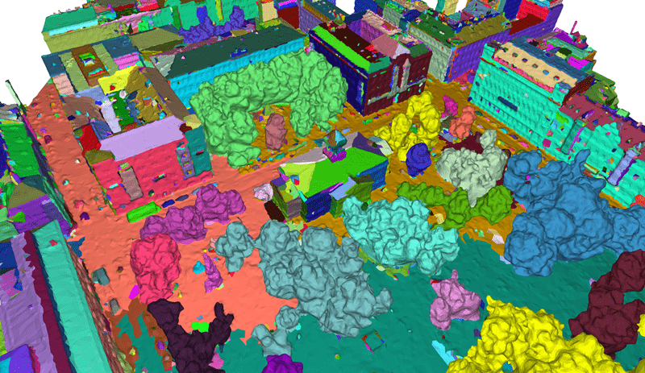

# PSSNet: **P**lanarity-sensible **S**emantic **S**egmentation of Large-scale Urban Meshes (Step-1).

This is part of the implementation of the paper: [*PSSNet: Planarity-sensible Semantic Segmentation of Large-scale Urban Meshes*](https://www.sciencedirect.com/science/article/pii/S0924271622003355). 
Specifically, it is used for *Step-1*: planarity-sensible over-segmentation. For *Step-2*: semantic classification, please refer to [*Step-2*](https://github.com/WeixiaoGao/PSSNet) repository.   
It is based on the implementation of [*SUM: Planarity-sensible Semantic Segmentation of Large-scale Urban Meshes*](https://www.sciencedirect.com/science/article/pii/S0924271622003355), which is an open-source program for automatic semantic segmentation of large-scale urban texture meshes.
It is mainly implemented in C++ with other open-source libraries, such as [CGAL](https://www.cgal.org/) and [Easy3D](https://github.com/LiangliangNan/Easy3D).
For more information, please visit our [project website](https://3d.bk.tudelft.nl/projects/meshannotation/).

<div align="center">    

</div>

## Citation

If you use it in a scientific work, we kindly ask you to cite it:

<div class="filteredelement"><strong>PSSNet: Planarity-sensible Semantic Segmentation of large-scale urban meshes</strong>. Weixiao Gao, Liangliang Nan, Bas Boom and Hugo Ledoux. <em> ISPRS Journal of Photogrammetry and Remote Sensing</em> 196 (2023) 32-44. <br/><a href="https://www.sciencedirect.com/science/article/pii/S0924271622003355"><i class="fas fa-external-link-alt"></i> PDF</a> <a href="#myref" data-toggle="collapse"><i class="fas fa-caret-square-down"></i> BibTeX</a> <div id="myref" class="collapse" tabindex="-1"><pre class="bibtex">@article{sum2021,
author = {Weixiao Gao and Liangliang Nan and Bas Boom and Hugo Ledoux},
title = {PSSNet: Planarity-sensible Semantic Segmentation of large-scale urban meshes},
journal = {ISPRS Journal of Photogrammetry and Remote Sensing},
volume = {196},
pages = {32-44},
year={2023},
issn = {0924-2716},
doi = {10.1016/j.isprsjprs.2022.12.020},
url = {https://www.sciencedirect.com/science/article/pii/S0924271622003355},
}
</pre></div></div>

## Usage
The program is currently only supported to run and compile on **Windows 10** system.
To use this program on other operating systems, the source code will need to be modified and updated.
If you would like to contribute to this project, please contact the author.

### Data organization
For the organization of the data in the folders, please refer to the [demo data](https://3d.bk.tudelft.nl/opendata/sum/1.0/data_demo/).

For the structure of `*.ply` data, we have added the following additional items.

|    names                 |    ply types      |    data types     |    description                                                      |
| :----------------------: |  :--------------: | :---------------: | :-----------------------------------------------------------------: |
| label                    | comment           | -                 | label definition, e.g., `comment label 1 ground`                  |
| label                    | property (face)   | int               | label stored at each facet                                          | 
| face_segment_id          | property (face)   | int               | segment id stored at each facet                                     |
| label_probabilities      | property (face)   | float             | probabilities stored at each facet                                  |
| segment_xxx_features_xxx | property (face)   | float             | features stored at each facet for visualization as scalar field     |
| segment_xxx_features_xxx | property (vertex) | list uint32 float | features stored at each vertex as intermediate data for computation |

### Data requirements
For the **format** of input meshes, the current program only support [`*.ply`](http://paulbourke.net/dataformats/ply/) 
format triangular meshes and `*.jpg` format textures, and each mesh file must have associated textures. 
For the mesh **topologies**, we only support manifold meshes.
For the **size** of mesh tiles, each tile should be larger than 50 x 50 m.  

### Running the code
Before you run the program, make sure that your input data meet the requirements and that you have configured `config.txt`.
You can refer to the [demo data](https://3d.bk.tudelft.nl/opendata/sum/1.0/data_demo_pssnet/) to check how to prepare the configuration file.
Besides, you need to install [`Python (>=3.7)`](https://www.python.org/), [`imbalanced-learn`](https://imbalanced-learn.org/), and [`numpy`](https://numpy.org/), and replace the `..\Python\Python37\Lib\site-packages\imblearn\over_sampling\_smote\filter.py` with provided `..\3rd_party\python_parsing\py_aug\filter.py`.
You could run the code as follows: 
```
.\semantic_urban_mesh_segmentation.exe [path to config.txt]
```
The generated graphs and point clouds are stored in ```.\data_demo\PSSNet\spg_input\graph_edges``` and ```.\data_demo\PSSNet\spg_input\pcl``` respectively. After obtaining the predictions from [*Step-2*](https://github.com/WeixiaoGao/PSSNet), simply copy the predictions into ```.\data_demo\PSSNet\spg_output\```, and run the *Evaluation_SOTA* mode. The parsed semantic mesh will be saved in the ```.\data_demo\PSSNet\spg_output\```, and evaluation results will be saved in ```.\data_demo\PSSNet\evaluation```.

### Operation modes for PSSNet
* **PSSNet_pipeline_for_GCN**: Run the following modes in sequence: *Get_labels_for_planar_non_planar_from_semantic*, *Pipeline*, *PSSNet_oversegmentation*, *PSSNet_oversegmentation_evaluation,* *PSSNet_graph_construction*, and *PSSNet_pcl_generation_for_GCN*.
* **Get_labels_for_planar_non_planar_from_semantic**: Use the label map defined in ```L1_to_L0_label_map``` to generate planar and non-planar ground truth meshes.
* **Pipeline**: Run the following modes in sequence: Mesh_feature_extraction, Train_and_Test_config, and Data_evaluation_for_all_tiles_config.
* **PSSNet_oversegmentation**: Performing over-segmentation of PSSNet by using geometric features and priors from planar and non-planar classifications.
* **PSSNet_oversegmentation_evaluation**: Evaluation of the mesh over-segmentation results according to the metric proposed in the paper. 
* **PSSNet_graph_construction**: Use the proposed four types of edges to construct the input graph for the GCN.
* **PSSNet_pcl_generation_for_GCN**: Generate a point cloud consisting of mesh vertices and face centers with hand-crafted features as input to the GCN.
* **Evaluation_SOTA**: Transferring the semantic labels from point clouds to mesh triangles and evaluating the results for PSSNet.

## Build from source

  1. Install following packages: [`boost (>=1.69)`](https://www.boost.org/), [`OpenCV (>=3.4)`](https://opencv.org/), [`Eigen 3`](https://eigen.tuxfamily.org/), [`OpenMP (>=2.0)`](https://www.openmp.org/), [`GMP`](https://gmplib.org/), [`MPFR`](https://www.mpfr.org/), [`Python (>=3.7)`](https://www.python.org/), [`imbalanced-learn`](https://imbalanced-learn.org/), and [`numpy`](https://numpy.org/). 
     Other required packages, including `CGAL`, `easy3d`, `boost_numpy`, `tbb`, and `gco` etc., are provided in this repository (folder `..\3rd_party\`).
  1. Build the `boost_numpy` and `tbb` first, then configure the CMake of SUMS with the paths of the all required packages.  
  1. Then build the `python_parsing` project. Rename the built dynamic library `python_parsing.dll` to `libpp.pyd`, and move it to `..\3rd_party\python_parsing\py_aug\`.
     Replace the `..\Python\Python37\Lib\site-packages\imblearn\over_sampling\_smote\filter.py` with provided `..\3rd_party\python_parsing\py_aug\filter.py`.
  1. Finally, build `semantic_urban_mesh_segmentation`.

## License
SUMS is free software; you can redistribute it and/or modify it under the terms of the 
GNU General Public License as published by the Free Software Foundation; either version 3
of the License or (at your option) any later version. The full text of the license can be
found in the accompanying 'License' file.

If you have any questions, comments, or suggestions, please contact me at <i>gaoweixiaocuhk@gmail.com</i>

[<b><i>Weixiao GAO</i></b>](https://3d.bk.tudelft.nl/weixiao/)

Feb. 2, 2023
